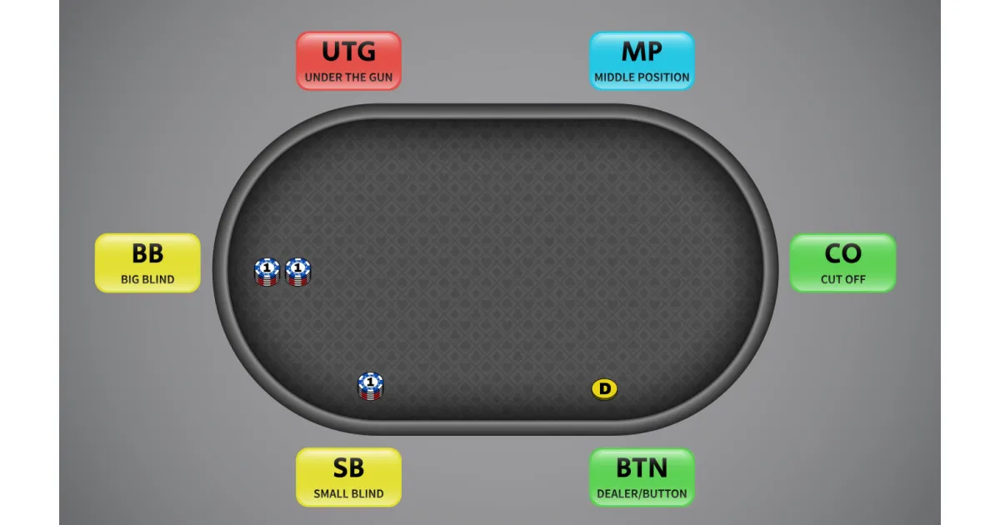

---
# 🃏 POKER AI GTO 助手

這是一個基於 **Streamlit + OpenAI API** 的德州撲克 GTO 助手。
你可以輸入自己的手牌、位置、籌碼量，以及其他玩家的行動路線，系統會依照 **GTO 策略** 給出行動比例建議（例如 `Check (60%)、Bet 1/3 Pot (30%)、Bet 1/2 Pot (10%)`），幫助你訓練與研究決策。
---

## 🚀 功能特色

- 支援 **6-max 現金桌**場景
- 輸入手牌、公共牌、位置、籌碼與行動
- 系統自動輸出 GTO 行動建議（比例形式，不含分析文字）
- 介面簡單直覺，基於 **Streamlit Web App**
- 使用 **OpenAI GPT-4o 模型**

---

## 📂 專案結構

```
.
├── main.py                 # 主程式入口
├── config.py               # 遊戲參數設定 (牌型、位置、行動...)
├── requirements.txt        # 相依套件
├── .gitignore              # Git 忽略規則
├── .env                    # 環境變數 (可存放 API Key，但建議用 Streamlit secret)
├── README.md               # 說明文件
├── pages/
│   └── 六人現金桌.py        # Streamlit Pages 子頁面
└── .streamlit/
    ├── config.toml         # Streamlit 設定檔
    └── secret.toml         # API Key 及敏感資訊
```

---

## ⚙️ 安裝與執行

### 1️⃣ 下載專案

```bash
git clone https://github.com/RonaldLiaoo/pokerAI.git
cd pokerAI
```

### 2️⃣ 建立虛擬環境並安裝依賴

```bash
pip install -r requirements.txt
```

### 3️⃣ 設定 OpenAI API Key

將 API Key 放在 `.streamlit/secrets.toml`：

```toml
[general]
OPENAI_API_KEY = "your_api_key_here"
```

或在 `.env` 中設定：

```bash
OPENAI_API_KEY=your_api_key_here
```

### 4️⃣ 執行程式

```bash
streamlit run main.py
```

---

## 🖥️ 使用方式



1. 選擇自己的 **手牌、花色、位置與籌碼**
2. 新增其他玩家的 **位置與籌碼**
3. 輸入各街道（Pre-Flop / Flop / Turn / River）的行動
4. 點擊 **打法建議** 按鈕，系統會輸出 GTO 建議行動比例

---

## 📌 待改進

- 支援 **不同桌型 (9-max, HU)**
- 提供 **Solver 模擬結果比對**

---

## ⚙️ 注意事項

- 請先在 `.streamlit/secrets.toml` 中設定你的 OpenAI API Key
- 本工具僅提供 **輔助學習**，實際牌局請自行判斷
- **本工具不提倡任何形式的賭博行為**，請勿將此程式用於真實金錢下注

---
